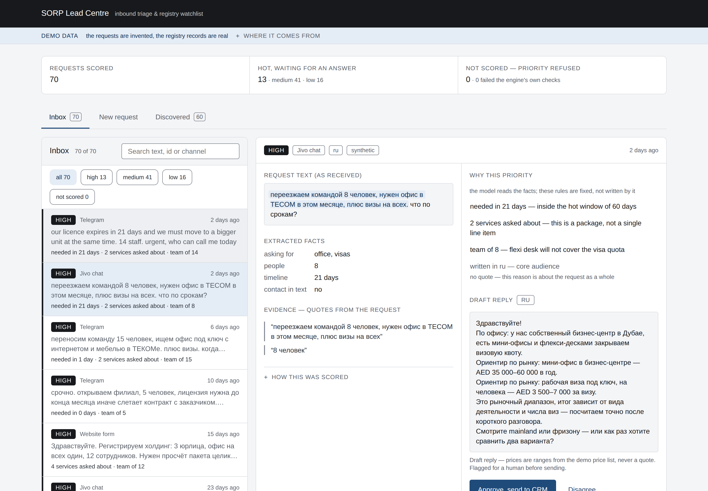
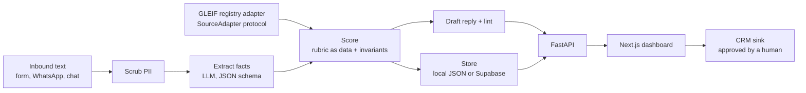
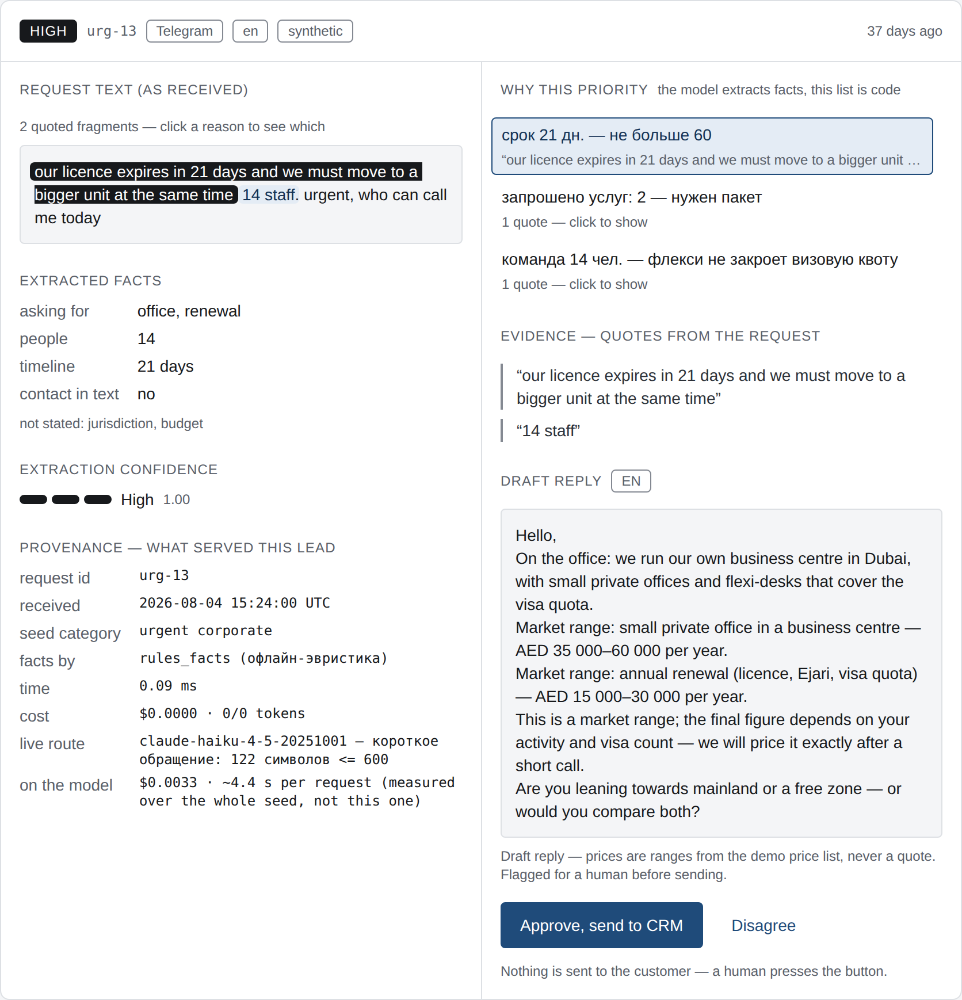
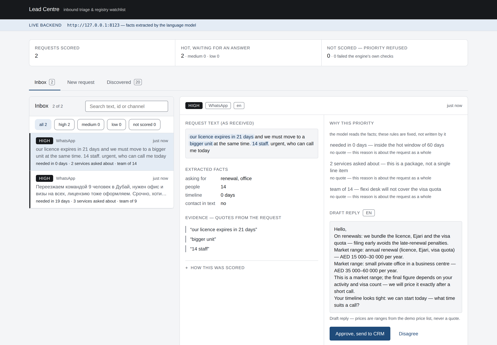
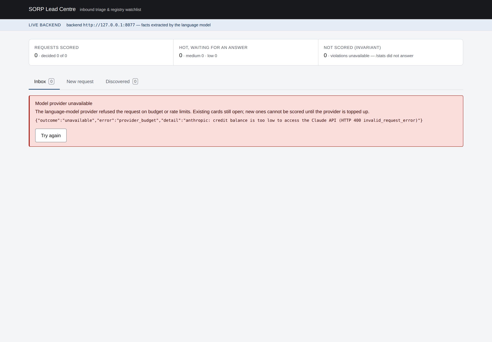
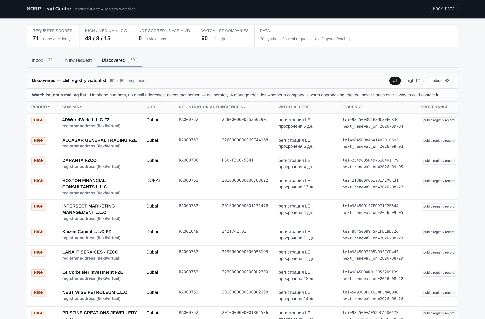

# Lead Centre

> Русская версия — [`README.md`](README.md).

[](https://github.com/greenflac/lead_centre/actions/workflows/ci.yml?query=branch%3Amain)

Every day people write to a Dubai consultancy — the website chat, WhatsApp, Telegram:
"how much does it cost to set up a company?", "I need an office for eight people from
October", "my visa expires in two weeks". Every one of those messages was already paid for
with advertising. Then it sits in a queue until a manager gets to it: hours, and overnight
until morning. The person writes to three other firms meanwhile; whoever answers first
keeps them. The money is spent, the lead is gone, and nobody counts how many.

This is the tool that closes that wait. A message arrives and within seconds the manager
has a card in front of them: what the person wants, how many people, what deadline, which
language, how hot the request is and exactly why — with quotes from their own message —
plus a draft reply in their language. The manager reads it, edits it, presses the button.
Nothing is ever sent by the system itself. The second half works the other way round: the
same engine reads a public UAE company registry and finds firms that will need these
services soon — a reason with a date and evidence, not a bought contact list.

What it is not: not a chatbot instead of a person, not a mailing list, not a replacement
for the manager. It is preparation for the manager's conversation.

A self-initiated test project built for an international consultancy in Dubai. It is not a
production system and is not connected to any of the firm's data. The inbound requests in
the demo are synthetic; the registry is real.



*The main screen: every inbound request already carries a priority, the reasons behind it,
the facts extracted from the text, and a draft reply in the customer's language. The header
counts what was scored and how many invariant violations there were.*

## How it earns its keep

The owner already pays for the requests arriving today. Recovering some of the ones that
burn out on response time is cheaper than buying new ones, and renewals — licences, visas,
tenancy — are revenue that repeats with the same client every year; the registry shows
whose date is coming up. No conversion figure and no rollout timeline is claimed anywhere
in this repository: the only numbers here are the ones a command prints.

## Running it

Python 3.11. `pip install -e ".[dev]"`.

```bash
make test-ci     # the whole test suite, network blocked by the machine, not by agreement
make demo        # the first paragraph of this file, checked end to end: 4 requests, ~32 checks
make run         # score registry companies from the cached sample, no network, no API key
python eval/run_eval.py --labels eval/labels_synthetic.csv   # the measurement bench
```

Everything else:

```bash
make test-ci-selfcheck  # negative control: a network call in that mode must fail
make check-web          # the dashboard's own instruments: contrast, design system, port vs engine
make discover           # the same scoring run, against the live GLEIF API
make mutate             # test run with the bytecode cache cleared (see the defect story)
python eval/run_eval.py --engine=llm --limit 10 --labels ...  # with live extraction, costs money
OFFLINE=1 python -m leadcentre.api                            # API on :8000
cd web && npm install && npm run dev                          # dashboard on :3000
```

`OFFLINE=1` means cached data and no network anywhere. The dashboard runs on generated mock
data with no backend attached, and switches to the API with a single environment variable
(`NEXT_PUBLIC_API_URL`); the header says which mode is on.

Keys are read from the environment: `CLAUDE_KEY` for the model, `SUPABASE_URL` plus keys for
the store, `HUBSPOT_PERSONAL_KEY` for the CRM sink. Without them the code falls back to the
local store and the null CRM sink — explicitly, never silently: an unknown value of
`LEADCENTRE_STORE` or `LLM_PROVIDER` is an error, not a default.

## Architecture



Three properties are deliberate:

**One engine, two intakes.** An inbound message and a registry company reach the same
`score` module and the same rubric. The registry axes are address type × event; an inbound
request adds an intent-and-urgency axis on top. Adding a source means implementing the
`SourceAdapter` protocol (`leadcentre/sources/base.py`) — GLEIF is one implementation, a
paid provider or a client's own export would be another, and the engine knows nothing about
either.

**The model proposes facts, the code decides the priority.** Extraction (`engine/extract.py`)
returns structured facts and nothing else. The tier comes from `engine/rubric.py` — thresholds
and the matrix are data in one file — plus invariants in `engine/score.py`: HIGH requires at
least one verbatim evidence quote, low extraction confidence caps the tier, a broken invariant
returns `INVALID` rather than a guess.



*Every priority is explained: the reasons come from the rubric, and the quotes are the
customer's own sentences. A request with no quote cannot be raised to HIGH — the engine
returns "not scored" instead of guessing.*

**Three outcomes, not two.** Every check returns `ok` / `not ok` / `could not check`, and
prints `checked N, violations M, could not K`. Zero violations out of zero checks is not a
pass. The same rule holds for the store (`success` / `rejected` / `unavailable`), the CRM
sink (`sent` / `rejected` / `unavailable` / `skipped`) and the reply linter.



*Shot against the real API, not the demo data: the bar names the backend address and the
facts came from the model. The 21-day deadline is the client's own, even though the same
message says "today" — that word counts as urgency, not as a date.*



*The failure path is part of the product. When the model provider refuses on budget or rate
limits, the API answers 402 with a machine-readable code and the dashboard shows this — not
a white screen, not an empty list that looks like "no leads".*

Model routing is by message length: requests up to 600 characters go to Haiku 4.5, longer
ones to Opus 5 (`engine/extract.py`). The threshold is a chosen constant with its rationale
next to it; the card records which model actually served the lead, taken from the API
response rather than from intent. Russian and English drafts are deterministic templates;
Arabic is written by the model inside limits set by the code and has to pass the same linter,
otherwise the card comes back with no draft and a reason.

Repository map:

| Path | What is there |
|---|---|
| `leadcentre/engine/` | extract, rubric, score, reply, lint, transliteration, shared fact heuristics |
| `leadcentre/sources/` | `SourceAdapter` protocol + GLEIF adapter |
| `leadcentre/store/`, `leadcentre/crm/` | local JSON / Supabase store, Null and HubSpot sinks |
| `leadcentre/api.py` | FastAPI, 9 routes; logic in functions, handlers only parse |
| `eval/` | measurement bench: Cohen's kappa, confusion matrix, stability, negative controls |
| `prompts/` | versioned prompts (`extract_v1`…`v5`, `translit_v1`), loaded by the code |
| `web/` | Next.js dashboard, mock mode and live mode (`web/README.md`) |
| `data/` | 70 synthetic requests, GLEIF samples, demo price list |
| `docs/` | one-pager, demo script, data notes (`docs/README.md`) |

## The registry side



*A watchlist, not a mailing list: name, city, registration authority, licence number and a
dated reason ("LEI registration lapsed 5 days ago"). There is no phone column, no e-mail
column and no "contact them" button, and the tab says so.*

## What is measured

Every number below came out of this repository. The command that produced it is named.

| Measurement | Value | Where from |
|---|---|---|
| Tests | 877 passed, 0 failed, 0 skipped | `make test-ci` — network is blocked by the machine, not by convention; the ban itself is checked by `make test-ci-selfcheck` |
| Agreement with the author's labels, Cohen's kappa | 0.838 (po 0.900, pe 0.382, 30 pairs, 27 matched) | `python eval/run_eval.py --labels eval/labels_synthetic.csv` |
| Stability, 3 runs of the same input | 1.0000 on 70 requests | same run |
| Negative controls | 6 of 6 | same run |
| Priority distribution on the 70-request seed | 13 HIGH / 41 MEDIUM / 16 LOW, 0 invariant violations | the engine over `data/inbound_seed.csv` |
| Cost per lead over the seed | $0.0033 cold cache, $0.0030 warm | token counts of the whole set, Haiku/Opus prices |
| Extraction latency | ~5 s per lead (8 edge-case requests, 35.1 s total, Haiku 4.5) | measured 2026-09-09 on live Haiku 4.5; not reproducible without an API key |
| Registry volume, UAE | 9 369 legal entities with an LEI, of which 3 940 have a lapsed LEI registration (golden copy of 2026-09-10; the registry is live and these move daily) | `docs/data/gleif_schema.md` — one curl re-checks them |

Reading of the agreement number, in the bench's own words (`eval/README.md`): it is
**agreement between the author's labels and the engine on synthetic requests**, not accuracy.
The requests are invented, and the person who wrote the labels also wrote the rubric, so the
figure shows that the engine reproduces the stated rubric — not that it reads customer intent
correctly. Accuracy needs a live inbound stream from the firm: two weeks of real requests, a manager's labels,
a parallel manual reply, and time-to-first-answer as the metric. `eval/labels_template.csv`
(30 rows) is waiting for the owner's labels; `eval/labels_synthetic.csv` is a stand-in by the
bench author and is marked as such in the file itself.

The bench is checked against itself, because a metric that never moves measures nothing: with
all labels forced to one class it prints `DEGENERATE` and exits "could not check" (code 2)
rather than 0; with labels shuffled on six seeds the kappa falls to between −0.2308 and
+0.1282 (measured against the 0.7436 baseline the bench had at the time). Decision constants
are checked by mutation in both directions (thresholds, matrix cells, target city, registrar
code, the intent ladder): lowering `RULES_CONFIDENCE_MATCHED` to 0.4 drops the kappa from
0.74 to 0.43 and the controls from 6 of 6 to 3 of 6, and tightening `KAPPA_TARGET`,
`STABILITY_TARGET` or `CONTROLS_EXPECTED` turns the matching block red. `URGENT_DEFAULT_DAYS`
was the one constant nothing guarded; it was removed together with the rule that invented a
deadline (2026-09-10) — see `eval/README.md`.

Tests do not reach the network, and that is enforced by `ci/sitecustomize.py` loaded through
`PYTHONPATH`, not by convention. `make test-ci-selfcheck` is the negative control for the ban
itself: a silent ban is indistinguishable from a missing one.

## Data boundaries

- **The 70 inbound requests are synthetic.** No exported request log was available here.
  Every row of `data/inbound_seed.csv` was written for this project (`docs/data/inbound_seed.md`):
  channels jivo 24 / whatsapp 20 / telegram 16 / form 10, languages ru 47 / en 16 / mixed 6 /
  ar 1, text length median 98 and max 1332 characters, including empty text, emoji-only and a
  long mixed-language message. Every card in the dashboard is tagged **synthetic data**. The
  distribution is our hypothesis about the channel mix, not a measurement of the firm's traffic;
  phone numbers and e-mail addresses in the seed are reserved fictional patterns only.
- **GLEIF is a real public registry, but only companies that hold an LEI.** That is roughly
  9 369 UAE entities, a slice skewed towards financial, trading and fund structures — not the
  whole Dubai licence base, and the flow of new entries is dozens per month, not thousands.
  Registry rows in the dashboard are tagged **public registry record**: the fields are the
  registry's, the priority and the reason are ours.
- **The price list is a demo.** `data/pricelist_demo.yaml` holds public market ranges and
  author-chosen values, marked in the file, in the draft replies and in the UI. These are not
  the firm's prices. Drafts only ever state a range, and the linter cross-checks every AED figure
  in a draft against the price list, so a hallucinated number fails the check.
- **Personal data is cut before the model call.** Phone numbers and e-mail addresses are
  stripped from the text before it is sent anywhere, and `has_contact` is derived from what
  the scrubber actually removed rather than from the model's opinion.
- **Screenshots are taken by hand after engine changes.** If a number inside an image
  disagrees with the table above, the table is the measured one.

## What this system does not do

It does not send anything to a customer — no e-mail, no WhatsApp message, no call. It does
not collect contact details from the registry: the Discovered tab has no phone or e-mail
column by design, and no "write to them" button. It is a triage and drafting tool with a
human on every outgoing action.

## What is not done, and why

- **No owner labels yet.** `eval/labels.csv` does not exist; the kappa above is against the
  author's stand-in labels. Until the owner fills in the 30-row template, the number says the
  engine follows the rubric, nothing more.
- **No n8n workflow.** It was planned and did not get built; there is no `n8n/` directory
  in this repository, and this line is here instead of a claim.
- **HubSpot is partly unverified.** Company creation was exercised live against the portal
  and the record deleted straight afterwards. Deals return 403 `MISSING_SCOPES` on the
  available token, so deals, contacts and v4 associations are written to the documented API
  shape but never confirmed by a live call. The default sink is `null`, so demo runs do not
  fill anyone's CRM; the `NullSink` reports `skipped`, not `sent`.
- **Model quality is measured on a small sample.** The Haiku/Opus comparison (5.9 s and
  $0.00299 per lead versus 8.1 s and $0.01598) rests on 3 requests, and one instability is
  known and unfixed: on the longest request Haiku returned a relative deadline as 7 days four
  times and 38 days twice over six runs, which is why long messages are routed to Opus.
- **Arabic drafts have not been read by a native speaker.** The card says so on the draft
  itself.
- **Prompt caching does not pay off on the cheap model.** Measured: with a ~2.9k-token prompt
  Haiku reports zero cache reads and zero cache writes — the prefix is below the model's
  threshold. On Opus the cache works (input 5.4× cheaper on a warm read) but with a 5-minute
  TTL, so it only helps above one lead per five minutes. Recorded as a negative result rather
  than dropped.
- **The API sends no CORS headers** (measured), so the dashboard proxies live calls through
  its own origin instead. Adding the middleware is a decision for whoever owns the API.

## Next step: risk signals on a company lead

**Not in the code.** No module, no adapter, no route, no test — a direction, not functionality.

Why it is next: the firm registers companies and opens bank accounts for them, and UAE
banks and regulators check beneficial owners, licence status and group structure before an
account exists. A client who fails those checks costs more than a lead nobody worked, so "who is
this company" belongs next to "what does this customer want" — all the engine reads today.

What it would produce: public signals gathered before a manager invests time — presence on
sanctions and restrictive-measure lists, licence and registration status, ownership structure and
links to parent companies, age and activity of the legal entity. GLEIF already carries the group
links as `direct-parent` / `ultimate-parent` relationships on records this repository fetches; no
code reads them yet. The output is not "good" or "bad" but a list of signals, each with its
source and date — the shape priority has now: a reason plus its evidence.

It goes inside the existing construction, not beside it: the same engine and rubric-as-data; each
list or registry is another implementation of the `SourceAdapter` protocol
(`leadcentre/sources/base.py`), as GLEIF is; the same three outcomes, `hit` / `no hit` /
`could not check`, printed as `checked N, hits M, could not K`; the same invariant — no citable
source and date, no signal, as no quote means no HIGH.

Obstacles first. Open sanctions data differs in coverage and freshness, and some aggregated lists
are licensed for non-commercial use only, so the licence decides what may be embedded at all.
Matching by name without a shared identifier produces false hits — Gulf names repeat and
transliterate several ways — so only a match on LEI or licence number would count as certain and
the rest stays a candidate for a human. A statement about a company carries legal weight, which
keeps the output a signal for a manager's decision, never an automatic refusal. No timeline and
no accuracy figure is claimed here, and no data provider is named: the candidate sources are
unreachable from this environment (network policy), and an unverified name is an invention.

## One defect, in full

**Symptom.** On a live run, short price questions were coming out HIGH. `prc-01` — the whole
message is "скок стоит фриз зона?" — should not outrank a team relocation.

**Cause.** The extractor has a `budget_hint` field, meaning "the customer named a budget".
The model was filling it with the customer's *question* about price: `prc-01` produced
`budget_hint = 'скок стоит'`, `acct-01` produced `'сколько в месяц выйдет'`. The scoring
code reads that field as "the customer signalled willingness to pay" and raised the tier.
The model was not hallucinating; it was answering a question the prompt had not asked
precisely enough — a question about a value is not a value.

**Search before fix.** The defect has a shape: *a customer's question recorded as a fact*.
Grepping for that shape rather than for that field found a second instance nobody had
reported — `jurisdiction_hint`, where a customer asking "mainland or freezone?" produced
`jurisdiction_hint = 'mainland, freezone'`, i.e. the engine believed the customer had already
chosen both. Both fields were fixed, not just the reported one.

**Fix.** `prompts/extract_v2.md`: `budget_hint` is filled only when a money figure is named
("no number, no budget_hint"), `jurisdiction_hint` is null when the customer is asking which
jurisdiction to pick, plus six examples sitting exactly on those boundaries. The prompt is a
versioned file; v1 stayed next to it for comparison.

**Measured, v1 → v2, three requests on Haiku 4.5.** `prc-01` budget_hint `'скок стоит'` → `None`;
`acct-01` `'сколько в месяц выйдет'` → `None`; `edge-03`, where a real figure was named,
kept its value — the negative control that the fix did not simply blank the field. `edge-03`
jurisdiction_hint `'mainland, freezone'` → `None`.

**What it cost.** The prompt grew from 1927 to 2934 input tokens per request (+52%), moving
the lead from about $0.0027 to about $0.0031. That was accepted: the growth bought three
boundaries, each of which had a defect behind it. It also had a side effect caught later —
compressing the examples in v3 lost the hint that kept `prc-01` classified as a company-setup
request, and the field started flapping until the hint was restored. Trimming examples is
only safe if you re-check the fields those examples were holding.

## Related notes in the repository

- `docs/onepager.md` — one page without jargon: the problem, the answer, what is shown honestly.
- `docs/data/gleif_schema.md` — registry schema, volumes and the two discovery signals.
- `docs/data/inbound_seed.md` — how the synthetic set is built and which edges it covers.
- `eval/README.md` — what each measured number means and where the bench is weak.
- `web/README.md` — dashboard modes, screenshots, and where the mock data comes from.
- `docs/loom_script.md` — a four-minute walkthrough over the screens that exist.
