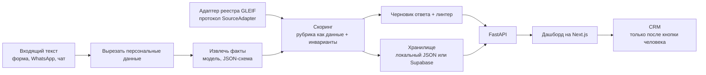

# Lead Centre

> English version — [`README.en.md`](README.en.md).

[](https://github.com/greenflac/lead_centre/actions/workflows/ci.yml?query=branch%3Amain)

Каждый день в консалтинговую компанию в Дубае пишут люди — в чат на сайте, в WhatsApp, в
Telegram: «сколько стоит открыть компанию?», «нужен офис на восемь человек с октября»,
«виза заканчивается через две недели». Каждое такое обращение уже оплачено рекламой, и
дальше оно лежит в очереди, пока до него дойдёт менеджер: часы, а ночью — до утра. Человек
за это время пишет ещё в три фирмы, и клиента забирает тот, кто ответил первым. **Lead
Centre закрывает это ожидание.** Через несколько секунд после обращения у менеджера на
экране готовая карточка: что человек хочет, сколько людей, к какому сроку, на каком языке,
насколько он горячий и почему именно так — с цитатами из его же сообщения, — плюс черновик
ответа на его языке. Менеджер читает, правит, нажимает кнопку и отвечает первым.


*Главный экран. Каждое обращение уже разобрано: приоритет, причины, извлечённые факты,
черновик ответа на языке клиента. Счётчики наверху — сколько обращений оценено, сколько
горячих ждут ответа и сколько движок отказался оценивать, потому что не хватило
доказательств.*

## Что это даёт владельцу

Владелец уже платит за обращения, которые приходят сегодня. Вернуть часть тех, что сгорают
из-за времени ответа, дешевле, чем купить новых. Разбор одного обращения стоит около трети
цента — расчёт и команда в таблице [«Что измерено»](#что-измерено).

Вторая половина работает в обратную сторону: тот же движок читает открытый реестр компаний
ОАЭ и находит тех, кому услуги понадобятся скоро — с поводом, датой и ссылкой на запись
реестра. Продления лицензий, виз и аренды — это выручка, которая повторяется у одного и
того же клиента каждый год; реестр показывает, у кого срок подходит.

Ни одной цифры конверсии и ни одного срока внедрения в этом репозитории не обещано: здесь
только те числа, которые печатает команда — и рядом с каждым написано, какая.

## Отправляет человек, а не система

Наружу клиенту не уходит ничего: ни письма, ни сообщения, ни звонка. Система готовит
разбор и черновик, кнопку нажимает менеджер. Это не настройка, которую забыли включить, а
устройство продукта — и по той же причине во вкладке с реестром нет колонок с телефоном и
почтой и нет кнопки «написать им».


*Приоритет всегда объяснён. Слева — извлечённые факты и дословные цитаты из обращения,
справа — причины, по которым движок поставил именно эту ступень, и черновик ответа.
Обращение без цитаты не может быть поднято в HIGH: движок вернёт «не смогли оценить»
вместо догадки.*

Тот же экран работает и на живой модели, а не только на демо-данных: рецензент вставляет
любой текст и получает карточку.


*Кадр снят против настоящего API, а не против демо-данных: полоса сверху называет адрес
бэкенда, факты извлекла модель. Срок «21 день» взят из фразы клиента, хотя в том же
сообщении стоит слово «today» — оно считается срочностью, а не датой.*

Эти два кадра снимает команда `make shots-live`: она поднимает живой контур, проверяет,
что `/health` отвечает `offline: false`, и отказывается снимать, если это не так. Нужен
оплаченный ключ модели.

## Что измерено

Каждое число ниже получено в этом репозитории, и рядом стоит команда, которой его
перепроверить. Прогон — 2026-09-11.

| Что меряем | Значение | Чем получено |
|---|---|---|
| Тесты | 877 прошло, 0 упало, 0 пропущено | `make test-ci` — сеть запрещена машиной, а не договорённостью; сам запрет проверяется `make test-ci-selfcheck` |
| Согласие с ручной разметкой, каппа Коэна | 0,838 (po 0,900, pe 0,382, 30 пар, совпало 27) | `python eval/run_eval.py --labels eval/labels_synthetic.csv` |
| Стабильность: три прогона одного текста | 70 из 70 обращений дали один и тот же приоритет | тот же прогон |
| Негативные контроли | 6 из 6 | тот же прогон |
| Распределение приоритетов на наборе из 70 обращений | 13 горячих / 41 средних / 16 холодных, 0 нарушений инвариантов | `PYTHONPATH=. python3 web/scripts/gen_mock.py` — движок проходит `data/inbound_seed.csv` и кладёт счётчики в `web/mock/stats.json` |
| Сквозная проверка первого абзаца этого файла | выполнено всё, что проверялось; число проверок 31 или 32 | `make demo` — четыре обращения проходят весь путь от текста до черновика. Проверок 32, когда арабский черновик написан, и 31, когда модель недоступна и движок честно возвращает третий исход |
| Реестр LEI по ОАЭ | 9 369 компаний с юридическим адресом в ОАЭ, из них 3 940 с просроченной регистрацией | выгрузка 2026-09-10, `docs/data/gleif_schema.md` — там же curl, которым это пересчитывается |
| Вкладка «Найдено» | 60 компаний: 16 горячих, 44 средних, 0 нарушений инвариантов | тот же прогон: `GleifAdapter(offline=True)` по кэшу реестра |
| Скоринг реестра из кэша | проверено 30, 5 горячих / 25 средних, 0 нарушений инвариантов, 0 пропущено | `make run` |
| Стоимость разбора одного обращения | ≈ $0,0033 на холодном кэше, ≈ $0,0030 на тёплом — **РАСЧЁТ**, не выписка по счёту | токены каждого вызова пишутся в `data/extract_cache.json` при `python eval/run_eval.py --engine=llm --limit 10 --labels …` (нужен ключ), цена считается по прайсу моделей |
| Время разбора на живой модели | 5,4 с, уверенность извлечения 0,90, 3 494 входных токена (ИЗМЕРЕНО 2026-09-11, Haiku 4.5) | `make shots-live` с ключом `CLAUDE_KEY`; без ключа не воспроизводится |

Каппа — это **согласие разметки автора с движком на синтетических обращениях**, а не
точность. Обращения придуманы, и разметку писал тот же человек, что и рубрику: число
показывает, что движок воспроизводит заявленные правила, а не что он угадывает намерение
клиента. Точность меряется только на живом потоке — две недели реальных обращений, разметка
менеджера, параллельный ручной ответ и время до первого ответа как метрика.
`eval/labels_template.csv` (30 строк) ждёт разметки владельца; `eval/labels_synthetic.csv` —
заглушка автора стенда, и в самом файле это написано.

Сам прибор проверен негативным контролем, потому что метрика, которая не двигается, не
меряет ничего: при разметке, схлопнутой в один класс, стенд печатает `ВЫРОЖДЕНО` и выходит
с кодом 2, а не с нулём; на перемешанных метках каппа падает около нуля. Константы-решения
проверены мутацией в обе стороны — занижение `RULES_CONFIDENCE_MATCHED` до 0.4 роняет каппу
с 0,8381 до 0,4747 и контроли с 6 из 6 до 3 из 6, ужесточение целевого порога по контролям
переводит блок не в «не годно», а в третий исход «не смогли проверить». Границы измерения —
`eval/README.md`.

## Как запустить

Python 3.11, `pip install -e ".[dev]"`. Ключи и сеть не нужны.

```bash
make test-ci     # весь набор тестов, сеть запрещена машиной
make demo        # первый абзац этого файла, проверенный сквозняком: 4 обращения, ~32 проверки
make run         # скоринг компаний реестра из кэша: без сети и без ключа API
python eval/run_eval.py --labels eval/labels_synthetic.csv   # измерительный стенд
```

Всё остальное:

```bash
make test-ci-selfcheck  # негативный контроль: сетевой вызов в этом режиме обязан упасть
make check-web          # приборы дашборда: контраст, сверка стилей, сверка порта с движком
make discover           # тот же скоринг, но против живого API GLEIF
make mutate             # прогон тестов с очищенным кэшем байт-кода
OFFLINE=1 python -m leadcentre.api            # API на :8000
cd web && npm install && npm run dev          # дашборд на :3000
```

`OFFLINE=1` означает кэш вместо сети везде. Дашборд по умолчанию работает на сгенерированных
демо-данных вообще без бэкенда и переключается на API одной переменной среды
(`NEXT_PUBLIC_API_URL`); режим написан в шапке, чтобы демо-числа нельзя было принять за
боевые.

Ключи читаются из среды: `CLAUDE_KEY` для модели, `SUPABASE_URL` и ключи для хранилища,
`HUBSPOT_PERSONAL_KEY` для CRM. Без них код переключается на локальное хранилище и пустой CRM-сток —
явно, а не молча: неизвестное значение `LEADCENTRE_STORE` или `LLM_PROVIDER` — это ошибка, а
не молчаливая подстановка умолчания.

## Как устроено



Три свойства сделаны намеренно.

**Один движок, два входа.** Обращение клиента и компания из реестра попадают в один и тот
же модуль скоринга и одну и ту же рубрику. Добавить источник — значит реализовать протокол
`SourceAdapter` ([`leadcentre/sources/base.py`](leadcentre/sources/base.py)); GLEIF — одна
реализация, платный поставщик или выгрузка клиента были бы другой, и движок о них ничего не
знает.

**Модель предлагает факты, приоритет решает код.** Извлечение
([`leadcentre/engine/extract.py`](leadcentre/engine/extract.py)) возвращает структурированные
факты и больше ничего. Ступень считает [`rubric.py`](leadcentre/engine/rubric.py) — пороги и
матрица лежат данными в одном файле — плюс инварианты в
[`score.py`](leadcentre/engine/score.py): HIGH требует хотя бы одной дословной цитаты, низкая
уверенность извлечения не даёт поднять ступень, нарушенный инвариант возвращает `INVALID`, а
не догадку.

**Три исхода, а не два.** Каждая проверка отвечает `годно` / `не годно` / `не смогли
проверить` и печатает рядом `проверено N, нарушений M, не смогли K`: ноль нарушений при нуле
проверок — это не успех. То же правило держат хранилище (`успех` / `отказ` / `недоступно`),
CRM-сток (`отправлено` / `отказ` / `недоступно` / `пропущено`) и линтер черновиков.


*Путь отказа — часть продукта. Когда провайдер модели отказывает по бюджету или лимиту,
API отвечает 402 с машиночитаемым кодом, а интерфейс показывает это: не белый экран и не
пустой список, который читается как «лидов нет».*

Маршрут по моделям выбирается длиной сообщения: до 600 знаков — Haiku 4.5, длиннее — Opus 5.
Порог — выбранная константа, обоснование лежит рядом с ней; в карточку пишется та модель,
которая реально ответила, взятая из ответа API, а не из намерения. Русский и английский
черновики — детерминированные шаблоны; арабский пишет модель в рамках, заданных кодом, и он
обязан пройти тот же линтер, иначе карточка вернётся без черновика и с причиной.

| Путь | Что там |
|---|---|
| `leadcentre/engine/` | извлечение, рубрика, скоринг, черновик, линтер, транслитерация |
| `leadcentre/sources/` | протокол `SourceAdapter` и адаптер GLEIF |
| `leadcentre/store/`, `leadcentre/crm/` | локальное JSON-хранилище и Supabase, пустой сток и HubSpot |
| `leadcentre/api.py` | FastAPI, 9 маршрутов; логика в функциях, обработчики только разбирают запрос |
| `eval/` | измерительный стенд: каппа, матрица ошибок, стабильность, негативные контроли |
| `prompts/` | версионированные промпты (`extract_v1`…`v5`, `translit_v1`), их грузит код |
| `web/` | дашборд на Next.js, демо-режим и живой режим ([`web/README.md`](web/README.md)) |
| `data/` | 70 синтетических обращений, выборки GLEIF, демонстрационный прайс |
| `docs/` | одна страница о задаче, сценарий демонстрации, заметки о данных ([`docs/README.md`](docs/README.md)) |

## Реестр: список наблюдения, а не база для рассылки


*Каждая строка — реальная запись открытого реестра: название, тип адреса, город, повод с
датой («регистрация LEI просрочена 5 дней назад») и доказательство — срок продления и номер
LEI. Поля берутся из реестра, приоритет и повод — наш вывод. Колонок с телефоном и почтой
нет, и вкладка прямо объясняет почему.*

## На каких данных это показано

- **70 обращений во входящих синтетические** — экспортированного лога обращений здесь нет,
  все строки `data/inbound_seed.csv` написаны для этого проекта
  ([`docs/data/inbound_seed.md`](docs/data/inbound_seed.md)): каналы jivo 24 / whatsapp 20 /
  telegram 16 / форма 10, языки ru 47 / en 16 / смешанный 6 / ar 1, длина текста от пустой
  строки и одних эмодзи до 1332 знаков. Каждая карточка помечена в интерфейсе как
  синтетическая.
- **Реестр GLEIF настоящий**, но в нём только компании, получившие LEI: 9 369
  юридических лиц ОАЭ с перекосом в финансовые, торговые и фондовые структуры — это не вся
  лицензионная база Дубая. Строки реестра помечены как запись открытого реестра.
- **Прайс демонстрационный** (`data/pricelist_demo.yaml`): публичные рыночные диапазоны,
  помечены как таковые в файле, в черновиках и в интерфейсе. Черновик называет только
  диапазон, а линтер сверяет каждую сумму в дирхамах с прайсом — выдуманное число не пройдёт
  проверку.
- **Персональные данные режутся до вызова модели.** Телефоны и почты вырезаются из текста
  перед отправкой куда бы то ни было, а признак «контакт есть» выводится из того, что
  вырезал скруббер, а не из мнения модели.
- **Скриншоты снимаются руками** после изменений движка. Если число внутри картинки
  расходится с таблицей выше — измеренное то, что в таблице.

## Где это работает, а где нужен следующий шаг

Сегодня система разбирает обращение, объясняет приоритет доказательствами и готовит
черновик — на любом входе, который можно вставить текстом, и на реестре, который отдаёт LEI.
Дальше начинается то, что требует данных владельца и решения владельца:

- **Разметка владельца.** Каппа выше — согласие с разметкой автора. Тридцать строк
  `eval/labels_template.csv`, заполненные менеджером, превращают её в согласие с практикой
  компании; до этого число говорит только о воспроизведении рубрики.
- **Живой поток вместо синтетики.** Две недели реальных обращений дают то, чего синтетика
  дать не может: время до первого ответа, долю упущенных и долю несогласий менеджера.
- **CRM.** Создание компании в HubSpot проверено живым вызовом, запись удалена сразу после.
  Сделки, контакты и связи v4 написаны по документированной форме API, но живым вызовом не
  подтверждены: доступный токен отвечает 403 `MISSING_SCOPES`. Сток по умолчанию — пустой,
  демо-прогон ничей CRM не заполняет.
- **Арабский черновик** не читал носитель языка, и карточка это говорит.
- **Кэш промпта не окупается на дешёвой модели** (замер): на промпте ~2,9 тыс. токенов Haiku
  отдаёт ноль чтений и ноль записей кэша — префикс ниже порога модели. На Opus кэш работает
  (вход на тёплом чтении дешевле в 5,4 раза), но живёт 5 минут, то есть помогает от одного
  обращения в пять минут и чаще. Записано как отрицательный результат.
- **API не отдаёт CORS-заголовков** (замер), поэтому живые вызовы дашборд проксирует через
  свой origin. Добавлять ли middleware — решение владельца API.

## Следующий шаг: сигналы риска по компании

**Кода нет.** Ни модуля, ни адаптера, ни маршрута, ни теста — это направление, а не
функциональность.

Почему именно оно следующее: фирма регистрирует компании и открывает им счета, а банки и
регуляторы ОАЭ проверяют бенефициаров, статус лицензии и структуру группы до того, как счёт
появится. Клиент, который не проходит эти проверки, стоит дороже, чем необработанный лид,
поэтому вопрос «что это за компания» встаёт рядом с вопросом «чего хочет этот клиент».

Что это давало бы: публичные сигналы, собранные до того, как менеджер вложил время, —
присутствие в санкционных и ограничительных списках, статус лицензии и регистрации,
структура владения и связи с материнскими компаниями, возраст и активность юрлица. GLEIF уже
отдаёт связи `direct-parent` / `ultimate-parent` в тех же записях, которые репозиторий
скачивает сегодня; кода, который их читает, пока нет. Результат — не «хорошая» или «плохая»
компания, а список сигналов, у каждого источник и дата: та же форма, что у приоритета
сегодня, — причина плюс доказательство.

Встраивается внутрь существующей конструкции, а не рядом: тот же движок и рубрика данными;
каждый список или реестр — ещё одна реализация протокола `SourceAdapter`, как GLEIF; те же
три исхода `есть` / `нет` / `не смогли проверить`; тот же инвариант — нет источника с датой,
нет сигнала, как нет цитаты — нет HIGH.

Препятствия честнее назвать сразу. Открытые санкционные данные различаются по охвату и
свежести, а часть агрегированных списков лицензирована только для некоммерческого
использования — лицензия решает, что вообще можно встраивать. Сопоставление по названию без
общего идентификатора даёт ложные попадания: имена в Заливе повторяются и транслитерируются
несколькими способами, поэтому достоверным считается только совпадение по LEI или номеру
лицензии, остальное остаётся кандидатом для человека. Утверждение о компании имеет
юридический вес, и это оставляет результат сигналом для решения менеджера, а не
автоматическим отказом. Ни сроков, ни цифр точности здесь не заявлено, и ни один поставщик
данных не назван: кандидатные источники из этой среды недоступны по сетевой политике, а
непроверенное имя — это выдумка.

## Один дефект целиком

**Симптом.** На живом прогоне короткие вопросы о цене выходили в HIGH. `prc-01` — всё
сообщение «скок стоит фриз зона?» — не должен обгонять переезд команды.

**Причина.** У извлечения есть поле `budget_hint` со смыслом «клиент назвал бюджет». Модель
клала туда *вопрос* клиента о цене: `prc-01` давал `budget_hint = 'скок стоит'`, `acct-01` —
`'сколько в месяц выйдет'`. Код скоринга читает это поле как «клиент показал готовность
платить» и поднимает ступень. Модель не галлюцинировала: она отвечала на вопрос, который
промпт задал недостаточно точно. Вопрос о величине — не величина.

**Поиск до починки.** У дефекта есть форма: *вопрос клиента, записанный как факт*. Grep по
форме, а не по полю, нашёл второй случай, о котором никто не сообщал: `jurisdiction_hint`,
где вопрос «mainland или freezone?» превращался в `jurisdiction_hint = 'mainland, freezone'`,
то есть движок считал, что клиент уже выбрал оба. Починены оба поля, а не одно
заявленное.

**Починка.** [`prompts/extract_v2.md`](prompts/extract_v2.md): `budget_hint` заполняется
только когда названа сумма («нет числа — нет `budget_hint`»), `jurisdiction_hint` пуст, когда
клиент спрашивает, какую юрисдикцию выбрать, плюс шесть примеров ровно на этих границах.
Промпт — версионированный файл, v1 остался рядом для сравнения.

**Замер, v1 → v2, три обращения на Haiku 4.5.** `prc-01` `budget_hint` `'скок стоит'` →
`None`; `acct-01` `'сколько в месяц выйдет'` → `None`; `edge-03`, где сумма действительно
названа, значение сохранил — негативный контроль того, что починка не просто обнулила поле.
`edge-03` `jurisdiction_hint` `'mainland, freezone'` → `None`.

**Чего это стоило.** Промпт вырос с 1927 до 2934 входных токенов на запрос (+52 %), обращение
подорожало примерно с $0,0027 до $0,0031 (число токенов печатает сам прогон извлечения,
поле `input_tokens` в ответе `POST /leads`; цена — расчёт по прейскуранту модели, не выписка). Это принято: рост купил три границы, за каждой из
которых стоял дефект. У него нашлось и побочное следствие: сжатие примеров в v3 потеряло
подсказку, которая держала `prc-01` в классе «регистрация компании», и поле начало плавать,
пока подсказку не вернули. Резать примеры безопасно только с перепроверкой тех полей,
которые эти примеры держали.

## Что ещё есть в репозитории

| Документ | О чём |
|---|---|
| [`docs/onepager.md`](docs/onepager.md) | одна страница без терминов: задача, решение, что показано честно |
| [`docs/loom_script.md`](docs/loom_script.md) | сценарий четырёхминутной демонстрации по работающим экранам |
| [`eval/README.md`](eval/README.md) | что означает каждое измеренное число и где стенд слаб |
| [`web/README.md`](web/README.md) | режимы дашборда, скриншоты, откуда берутся демо-данные |
| [`docs/data/gleif_schema.md`](docs/data/gleif_schema.md) | схема реестра, объёмы по ОАЭ и два сигнала для поиска |
| [`docs/data/inbound_seed.md`](docs/data/inbound_seed.md) | как собран синтетический набор и какие края он покрывает |
| [`README.en.md`](README.en.md) | English version of this document |

Инициативное тестовое задание: не боевая система и ни к каким данным заказчика не
подключена. Лицензия — [`LICENSE`](LICENSE).
